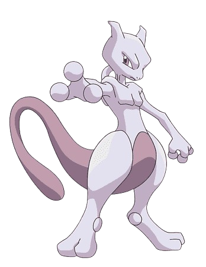

+++
title = 'Practica0'
date = 2025-05-29
draft = false
+++

<!-- Esto es un comentario -->

# Encabezado 1

## Encabezado 2

### Encabezado 3

#### Encabezado 4

##### Encabezado 5

<!-- Itálicas -->
Este es un texto en *itálica*

Este es un texto en _itálica_

<!-- Negritas -->
Este es un texto en **negritas**

Este es un texto en __negritas__

<!-- Tachado -->
Este `es un texto` ~~tachado~~

<!-- UL -->
* Elemento 1
* Elemento 2
* Elemento 3
  * Elemento 3.1
  * Elemento 3.2
    * Elemento 3.2.1
* Elemento 4

<!-- OL -->
1. Elemento 1
1. Elemento 2
1. Elemento 3
   1. Elemento 3.1
   1. Elemento 3.2
1. Elemento 4

<!-- Enlaces -->
[Texto de enlace](http://www.google.com "Texto del tooltip")

[UABC](http://www.uabc.mx)

[UABC](http://www.uabc.mx "Sitio Universitario")

<!-- Imágenes -->





[](http://www.uabc.mx "Sitio Universitario")


[](http://www.vscode.com)

<!-- Bloques de código -->
```txt
This is un code block
This is the second line of the code block
```

```python
print("Hola mundo!")
```

```javascript
console.log('Hello world!')

const test = ()
```

```html
<h1>Hola mundo!</h1>
```

<!-- Tablas -->
| Productos | Precio | Cantidad |
| - | - | - |
| Laptop | 3.3 | 2 |
| Mouse | 13.3 | 1 |

| Productos | Precio | Cantidad |
| --------- | ------ | -------- |
| Laptop    | 3.3    | 2        |
| Mouse     | 13.3   | 1        |

<!-- Notas -->
> Esto es una nota

<!-- Tareas -->
* [x] Primera tarea
* [ ] Segunda tarea
* [x] Tercera tarea
* [ ] Cuarta tarea

<!-- Divisores horizontales -->
***

---

___

<!-- Menciones -->
@darthrookie :+1: :smile: