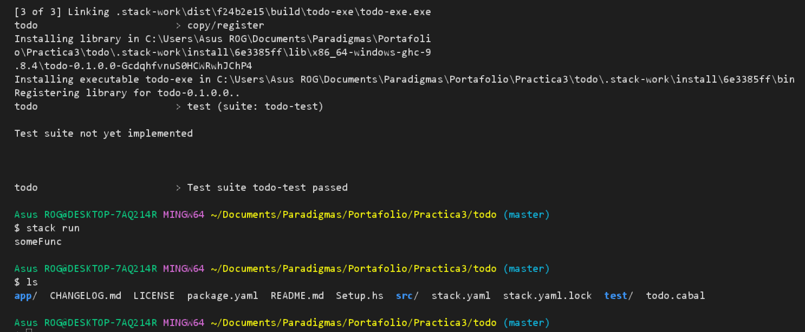
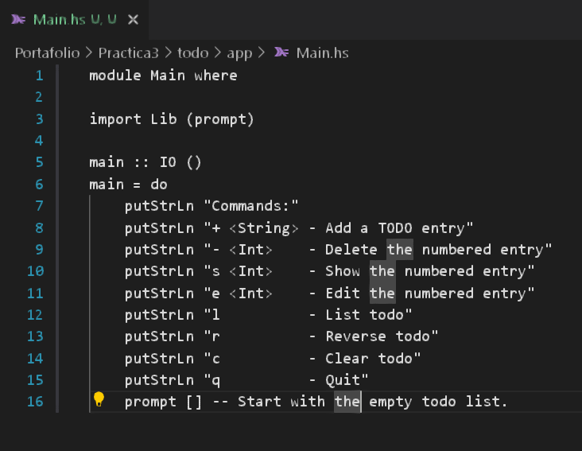
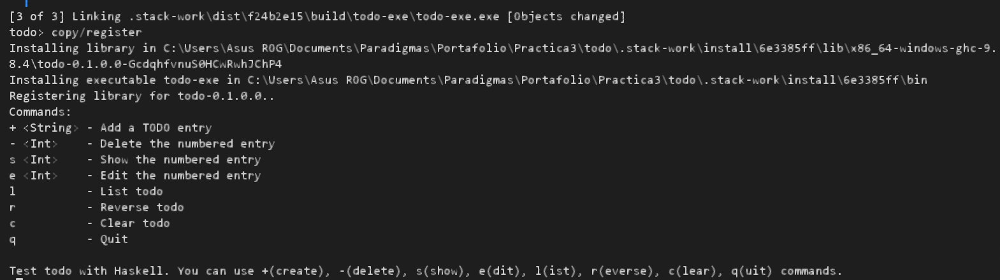
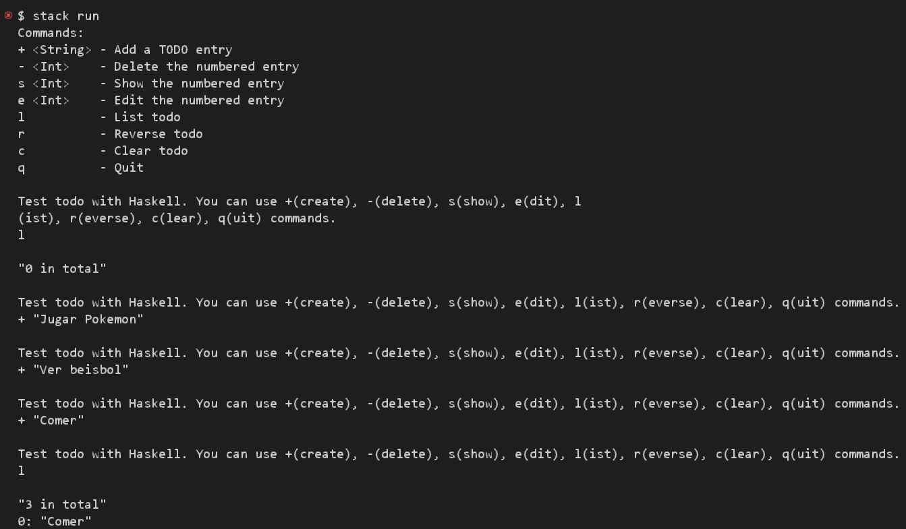
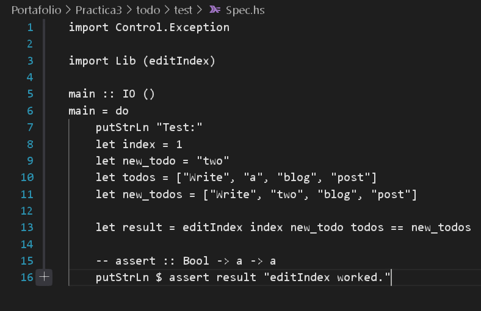
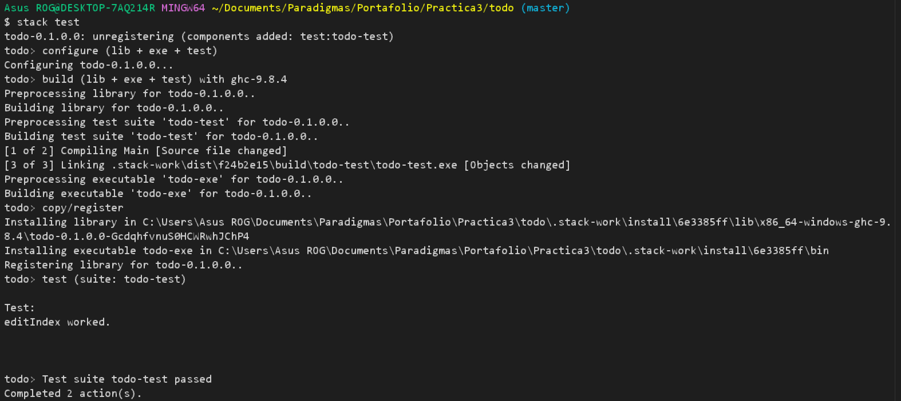

+++
title = 'Practica3'
date = 2025-05-29
draft = true
+++

# Paradigmas de la Programación
## Práctica 3

## Introducción
En este informe de práctica se detallará el proceso de creación de una aplicación de consola destinada a la gestión de listas de tareas (TODO list), desarrollada con el lenguaje de programación funcional **Haskell**. El propósito central fue adquirir conocimientos y familiarizarse con los principios básicos de Haskell, su sintaxis, el manejo de operaciones de entrada y salida, la manipulación de listas y el uso de herramientas como **Stack**. Esta actividad se llevó a cabo mediante la adaptación y el análisis de tutoriales y ejemplos existentes, con el fin de construir la aplicación de manera progresiva.

## Haskell y Stack: Entorno de desarrollo
**Haskell** es un lenguaje de programación puramente funcional. En el desarrollo de este proyecto se utilizó el compliador GHC (Glasgow Haskell Compiler), y se recurrió a **Stack** como herramientas principal para la gestión del proyecto, Stack permite crear proyectos de manera sencilla, gestionar sus dependencias , compilar y ejecutar el código, todo dentro de un entorno de desarrollo controlado. Además, garantiza la consistencia del entorno a encargarse de la instalación del compilador GHC y las bibliotecas necesarias de forma aislada para cada proyecto.

Durante esta sesión se generó un todo, con el cual utilizamos algunos comandos para verificar que fue creado correctamente.

Al aplicar stack test se ejecuta pruebas asociadas al proyecto de Haskell.

Después utilizamos stack run para ejecutar el proyecto Haskell que ha creado mostrando el resultado en la consola.

En main.hs se configuró una interfaz con la cual se mostrarán las operaciones que se podrán realizar utilizando el proyecto.

Después se modificará lib.hs para que se llame la función prompt con la cual volveremos a utilizar stack run y ahora sí podremos usar las operaciones

Posteriormente se agregó información al archivo spec.hs y se utilizó stack test para verificar que la lógica de la función editIndex es correcta.

